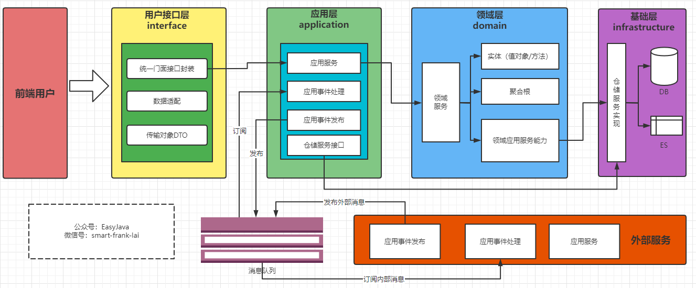
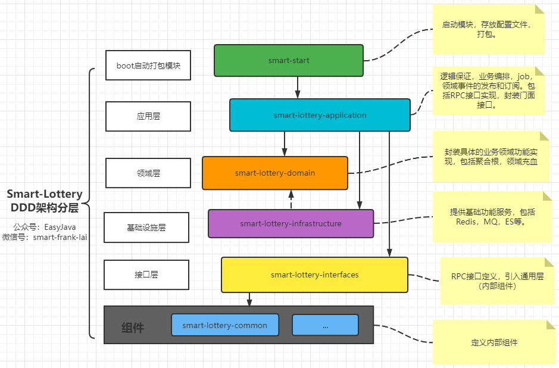

# smart-lottery
### 项目简介：

smart-lottery抽奖系统基于COLA架构采用DDD领域驱动中四层架构，涉及技术：SpringBoot、Mybatis、Dubbo、MQ、Redis、Mysql、ELK、分库分表、Otter等。
## 架构介绍：

> ​		本项目采用DDD（Domain-Driven Design 领域驱动设计）是由Eric Evans最先提出，目的是对软件所涉及到的领域进行建模，以应对系统规模过大时引起的软件复杂性的问题。整个过程大概是这样的，开发团队和领域专家一起通过 通用语言(Ubiquitous Language)去理解和消化领域知识，从领域知识中提取和划分为一个一个的子领域（核心子域，通用子域，支撑子域），并在子领域上建立模型，再重复以上步骤，这样周而复始，构建出一套符合当前领域的模型。

### 应用层

- 应用服务位于应用层。用来表述应用和用户行为，负责服务的组合、编排和转发，负责处理业务用例的执行顺序以及结果的拼装。
- 应用层的服务包括应用服务和领域事件相关服务。
- 应用服务可对微服务内的领域服务以及微服务外的应用服务进行组合和编排，或者对基础层如文件、缓存等数据直接操作形成应用服务，对外提供粗粒度的服务。
- 领域事件服务包括两类：领域事件的发布和订阅。通过事件总线和消息队列实现异步数据传输，实现微服务之间的解耦。

### 领域层

- 领域服务位于领域层，为完成领域中跨实体或值对象的操作转换而封装的服务，领域服务以与实体和值对象相同的方式参与实施过程。
- 领域服务对同一个实体的一个或多个方法进行组合和封装，或对多个不同实体的操作进行组合或编排，对外暴露成领域服务。领域服务封装了核心的业务逻辑。实体自身的行为在实体类内部实现，向上封装成领域服务暴露。
- 为隐藏领域层的业务逻辑实现，所有领域方法和服务等均须通过领域服务对外暴露。
- 为实现微服务内聚合之间的解耦，原则上禁止跨聚合的领域服务调用和跨聚合的数据相互关联。

### 基础层

- 基础服务位于基础层。为各层提供资源服务（如数据库、缓存等），实现各层的解耦，降低外部资源变化对业务逻辑的影响。
- 基础服务主要为仓储服务，通过依赖反转的方式为各层提供基础资源服务，领域服务和应用服务调用仓储服务接口，利用仓储实现持久化数据对象或直接访问基础资源。

### 接口层

- 接口服务位于用户接口层，用于处理用户发送的Restful请求和解析用户输入的配置文件等，并将信息传递给应用层。

### 服务启动层

+ 启动层依赖Application模块，主要增加启动器相关配置。用于打包，启动等操作！

## DDD 按模块分离系统搭建

### 项目分层结构

### 技术介绍

**后端技术**

| 技术                          | 说明               | 官网                                        |
| ----------------------------- | ------------------ | ------------------------------------------- |
| SpringBoot                    | 容器+MVC框架       | https://spring.io/projects/spring-boot      |
| Dubbo                         | RPC框架            | https://dubbo.apache.org/zh/                |
| MyBatis-plus                  | ORM框架            | https://baomidou.com/                       |
| RabbitMq                      | 消息队列           | https://www.rabbitmq.com/                   |
| Redis                         | 分布式缓存         | https://redis.io/                           |
| Docker                        | 应用容器引擎       | https://www.docker.com/                     |
| kubernetes                    | 容器集群自动化部署 | https://kubernetes.io/zh/                   |
| mariadb                       | 数据库             | https://mariadb.org/                        |
| db-router-spring-boot-starter | 分库分表           | 自研                                        |
| Otter                         | 分布式数据同步     | https://github.com/alibaba/otter/           |
| ELK                           | 实时日志平台       | https://www.elastic.co/cn/what-is/elk-stack |

## 容器化部署

### 组件部署

### 服务部署

## 技术支持

联系作者：smartfrank

微信：smart-frank-lai

公众号：EasyJava

